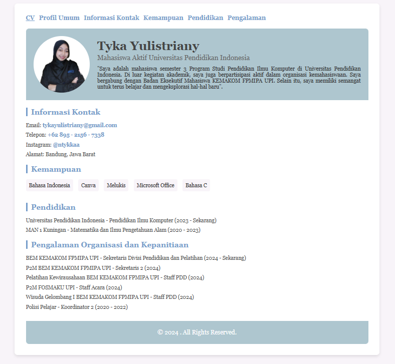

## CV Dengan Django
Ini adalah sebuah CV yang dikembangkan menggunakan framework Django untuk memenuhi tugas dalam mata kuliah Pemrograman Internet.

## Instalasi Django
**PASTIKAN KAMU SUDAH MENGINSTALL PYTHON!**

Langkah pertama adalah membuat folder untuk proyekmu:
```bash
mkdir project-kamu
cd project-kamu
```
Setelah itu, instal paket virtual environment, yang berfungsi untuk mengelola semua pustaka yang mungkin diperlukan dalam proyek Django:
```bash
pip install virtualenv
```
Selanjutnya, buat virtual environment di dalam folder proyekmu:
```bash
virtualenv venv
```
Aktifkan virtual environment tersebut di foldermu. Untuk pengguna Windows, jalankan:
```bash
venv\Scripts\activate
```
Setelah virtual environment aktif, instal Django dengan perintah berikut:
```bash
pip install django
```
Setelah menginstal Django, kamu dapat memulai proyek Django di dalam foldermu:
```bash
django-admin startproject project-kamu .
```
Kini, kamu dapat menjalankan proyek Django dengan perintah:
```bash
python manage.py runserver
```

## Hasil


## Dibuat Oleh
Nama         : Tyka Yulistriany\
NIM          : 2306838\
Program Studi: Pendidikan Ilmu Komputer-3B

--- 

&copy;Tyka Yulistriany2024.
